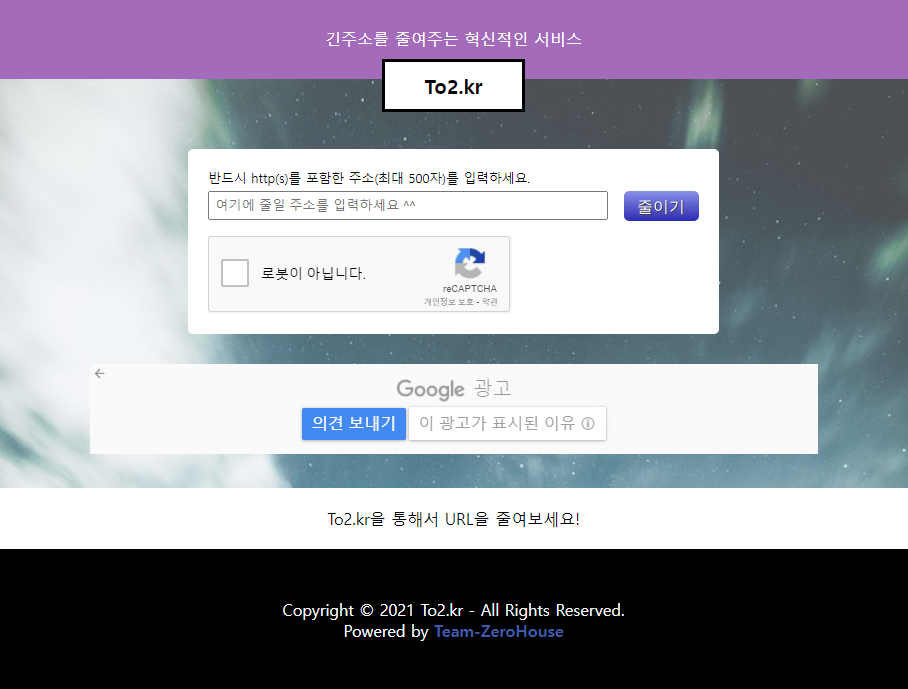

# to2.kr PHP legacy

주소를 짧게 줄여주는 서비스

**본 레포지토리는 to2 서비스의 레거시입니다. [Team-ZeroHouse/to2.kr-server](https://github.com/Team-ZeroHouse/to2.kr-server)로 마이그레이션 됐습니다.**

  

## 제작 의도

**2017년** 컴퓨터 학원에서 프로그래밍을 강의하던 [J강사](https://github.com/jhs512)와 [K강사](https://github.com/TsooranKim)는 수업 중 학생들에게 수업에 필요한 링크를 알려주는 것에 어려움이 있었고 기존에 나와있는 링크를 줄여주는 서비스를 사용하였다.

그러던 중 둘은 **본인들이 만든 것**이 있으면 좋겠다고 생각했고 수업이 끝난 뒤 카페에 앉아서 3시간 걸려서 뚝딱 만들었다.

## 코드 구조에 대하여

당시 Laravel이 유행하기 시작했고 라라벨을 쓰면이야 좋겠으나 *닭 잡는데 소 잡는 칼* 쓰는 게 아닌가 싶어 구조를 흉내 내서 만들었다.

## 디자인에 대해여

`to2.kr PHP legacy`의 페이지 디자인은 위 스크린샷 이미지와 같다. 페이지 디자인은 [K강사](https://github.com/TsooranKim)가 하였고 그는 만족스러워했으나 [J강사](https://github.com/jhs512)는 "촌스럽다"라고 했으나 딱히 대안이 없어 계속 사용하였다.

## 설정

`nginx.conf` 파일에 나타낸 것을 참고하여 `nginx`를 설정하면 됩니다.

`constants.php.sample` 파일을 `constants.php`로 파일명을 변경한 뒤 빠진 내용을 채워넣어야 합니다.

`blacklist.sample` 파일을 `blacklist`로 파일명을 변경해야 합니다.

`to2.sql` 파일을 통해서 DB를 구성하세요.

## 배포환경

현재(또는 가장 최근) 배포된 환경은 아래와 같습니다.

- **OS**: CentOS 7
- **HTTP Server**: nginx/1.16
- **PHP**: PHP/7.4
- **DB**: MariaDB/10.1

## License

to2.kr-php-legacy는 [Apache License, Version 2.0](./LICENSE)를 적용합니다.
